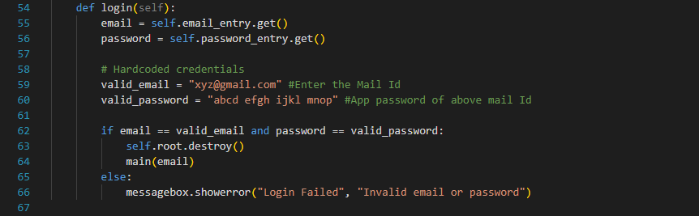
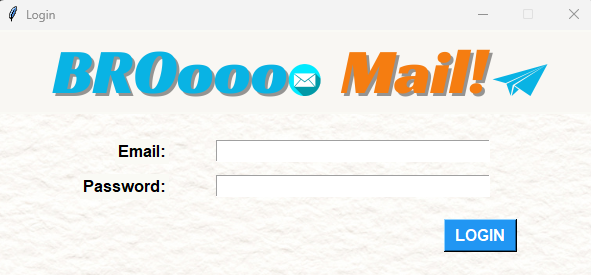
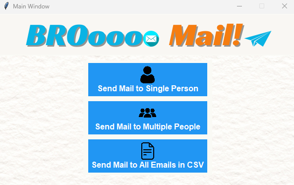
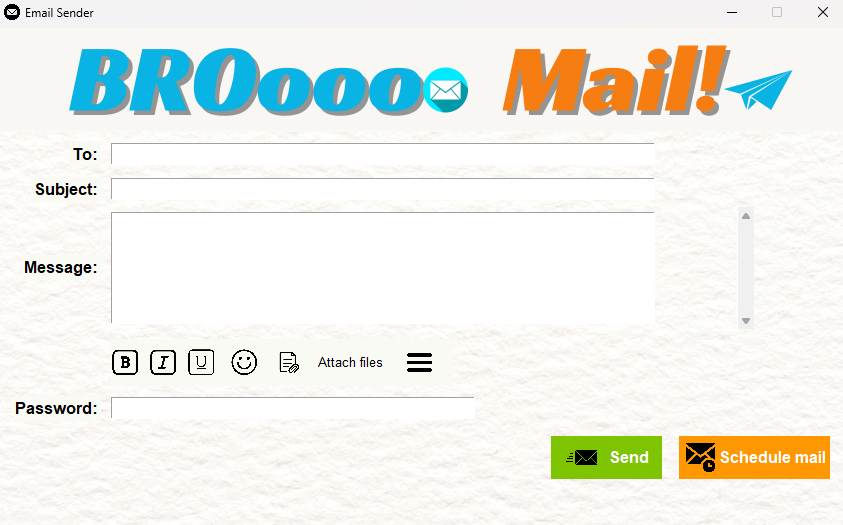

# EmailSenderApp

## Description
EmailSenderApp is a Python GUI application developed using the Tkinter library. It provides users with a user-friendly interface to manage email communications. The application allows users to securely log in, compose, format, and send emails easily. Features such as draft saving, attachment support, and scheduled sending enhance the user experience and streamline the email management process.

## Table of Contents
1. [Installation](#installation)
2. [Usage](#usage)
3. [Features](#features)
4. [Screenshots](#screenshots)
5. [Contributing](#contributing)
6. [License](#license)

## Installation
1. Clone the repository:
   ```git clone https://github.com/yourusername/EmailSenderApp.git```
2. Install the required dependencies:<br>
   `pip install Pillow` (This library is used to handle images, including loading and displaying them in the Tkinter GUI application.)<br>
   `pip install tkinter` (This library provides a standard Python interface to the Tk GUI toolkit.)<br>
   `pip install smtplib` (This library provides an SMTP client session object that can be used to send mail to any internet machine with an SMTP or ESMTP listener daemon.)<br>
3. Make some changes in the `Email_Sender.py` file: Add Sender's Email ID and App password

4. Run the application:``Email_Sender.py``

## Usage
1. Open the application.
2. Log in with your email credentials.
3. Compose your email by filling in the recipient(s), subject, message body, and optional attachments.
4. Use text formatting options like bold, italic, and underline if needed.
5. Save drafts for future reference or schedule emails to be sent at a later time.
6. Click the "Send" button to send the email.

## Features
- Secure login system
- Compose emails with text formatting options
- Attach files to emails
- Save drafts and load them for editing
- Schedule emails to be sent at a specific time

## Screenshots




## Contributing
Contributions are welcome! Please feel free to submit issues or pull requests.

## License
This project is licensed under the MIT License. Feel free to use and modify the code as needed.

---

Feel free to fork this repository, customize it according to your preferences, and use it to create your own Weather App. If you encounter any issues or have suggestions for improvement, please feel free to open an issue or pull request. Enjoy coding! 🌦️🌤️🌞


   
   
